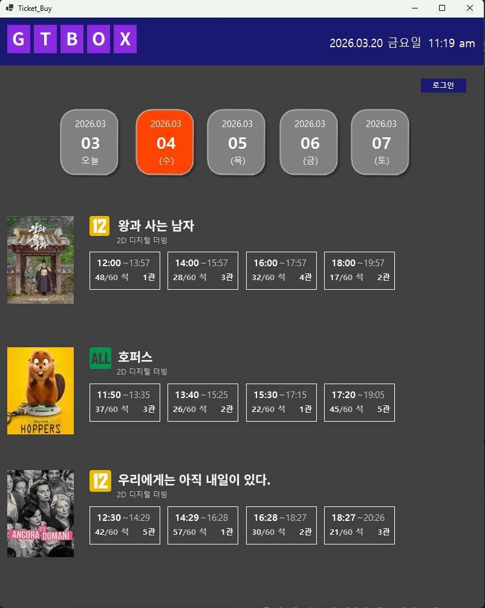
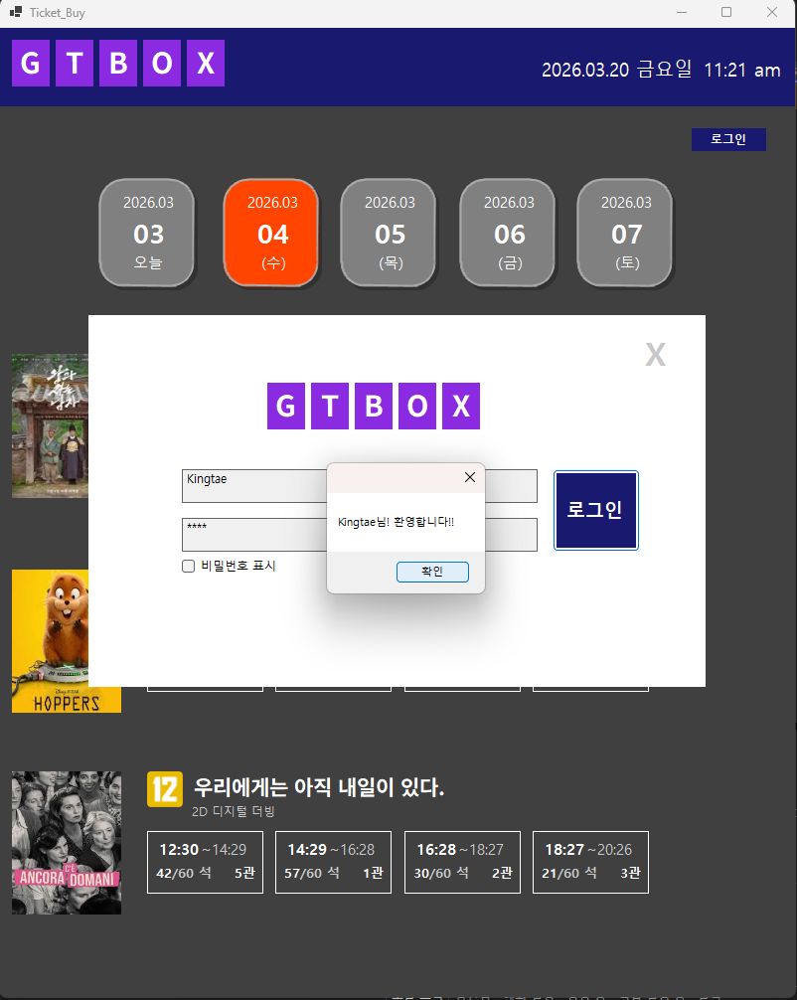
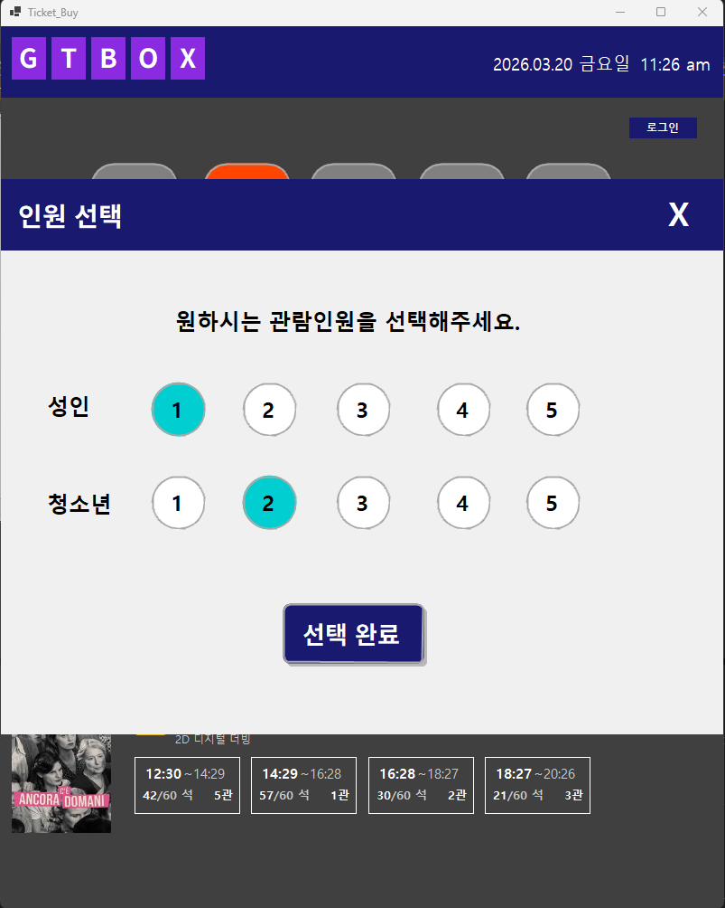
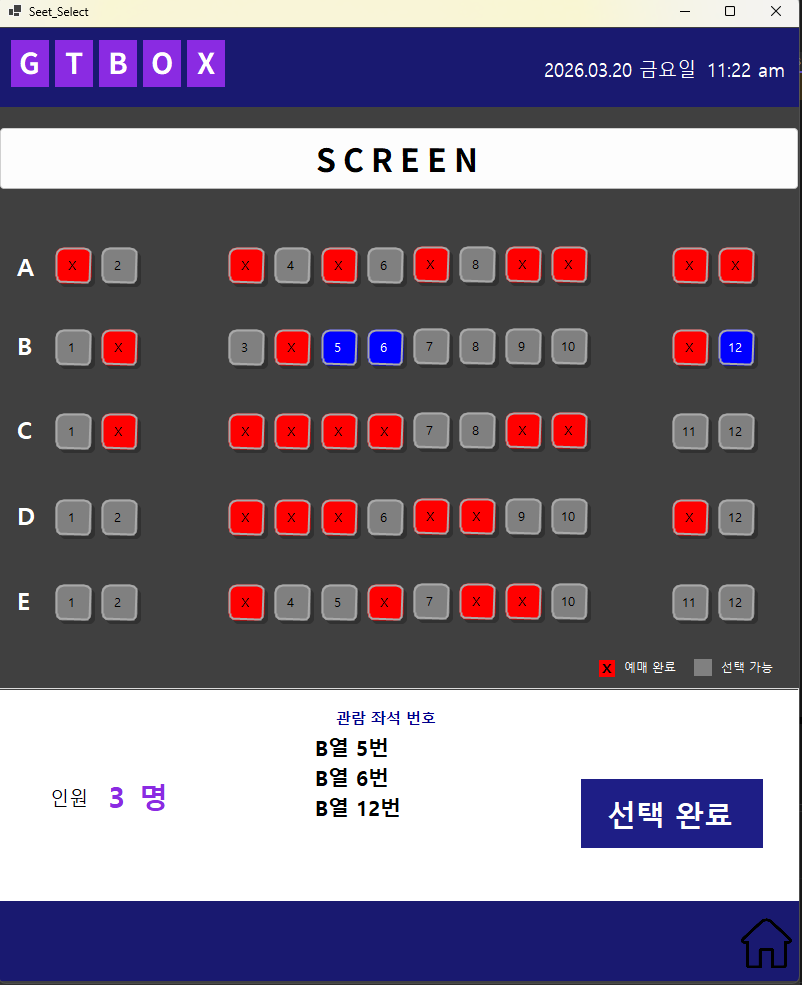
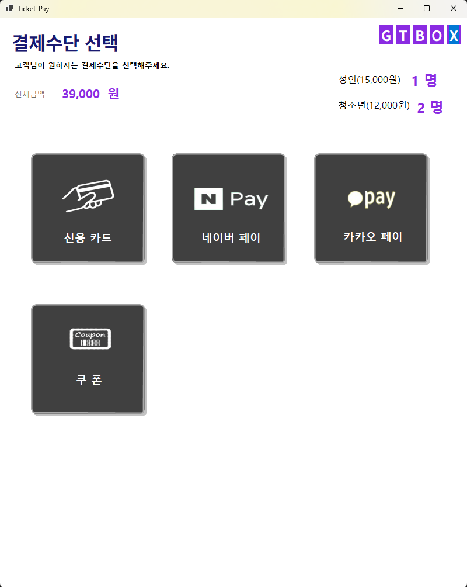
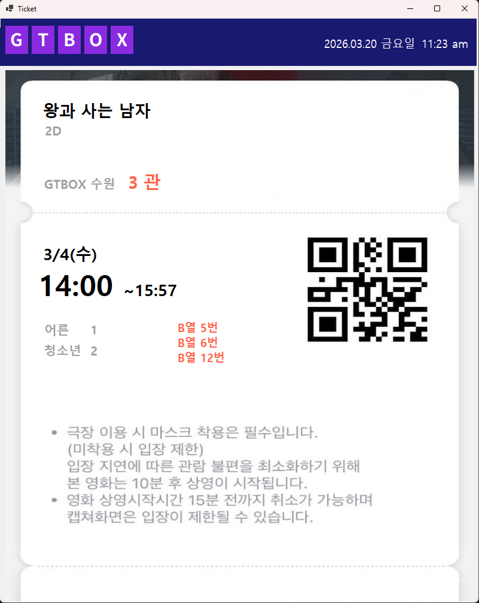
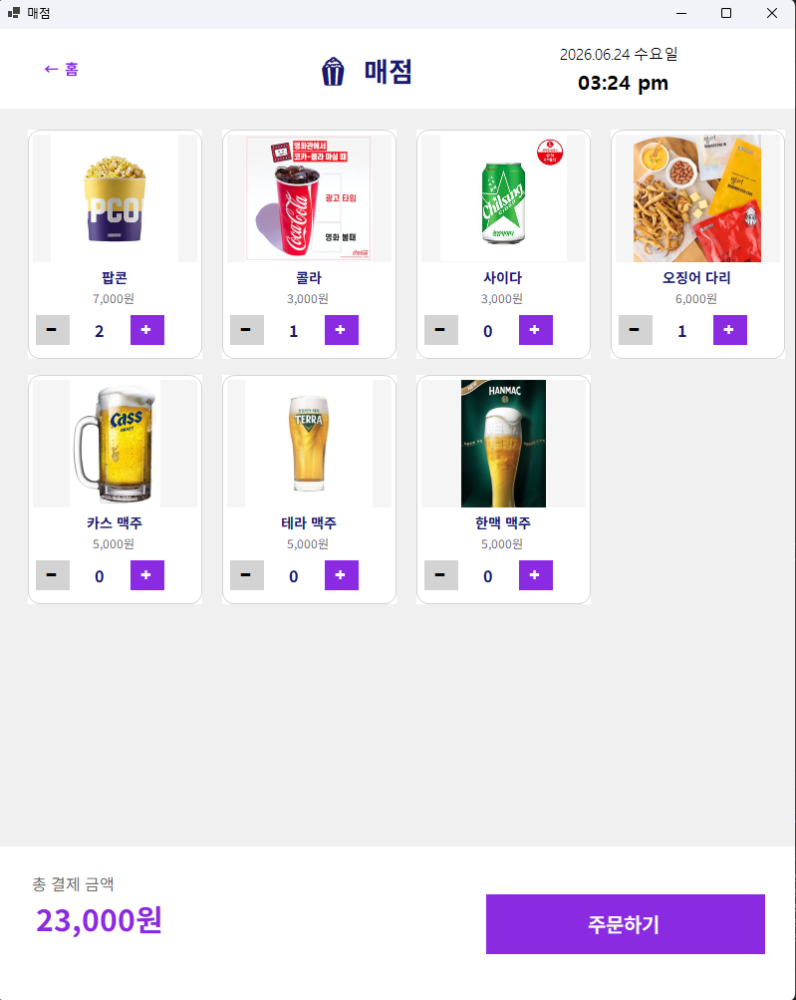
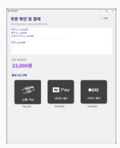
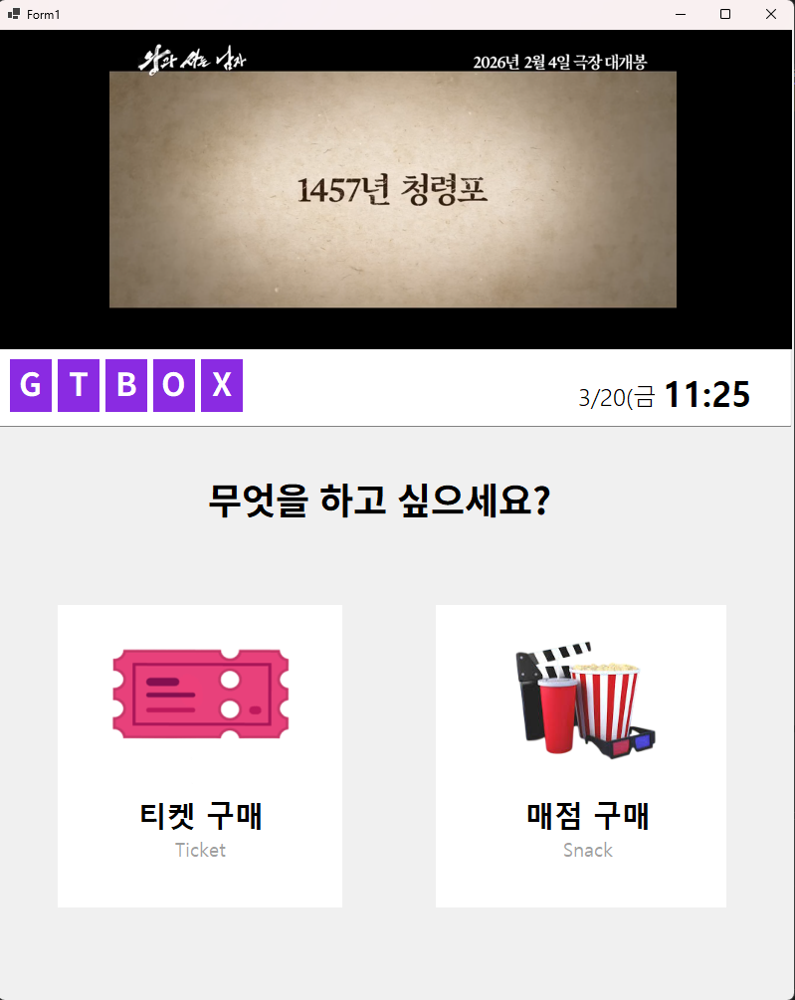

# Cinemia Kiosk — C# 기반 영화관 키오스크 시스템

> Windows Forms(C#)로 개발한 무인 영화관 키오스크 | 1인 개발

---

## 개요

실제 영화관 키오스크를 모델로 설계한 C# WinForms 애플리케이션입니다.  
메인 화면부터 로그인 → 영화 선택 → 인원/좌석 선택 → 결제 → 티켓 발매 → 매점 주문까지 무인 흐름 전체를 구현했습니다.

- **개발 기간**: 2026년 1학기
- **개발 인원**: 1인 (단독 개발)
- **개발 환경**: Visual Studio 2022, .NET Framework, C# / Windows Forms

---

## 주요 구현 내용

### 1. 날짜별 상영 스케줄 관리

- 5일치(3/3 ~ 3/7) 날짜 탭으로 영화별·상영관별·시간대별 좌석 현황 제공
- 각 버튼 클릭 시 날짜·상영관·시작/종료 시간을 다음 화면으로 파라미터 전달



### 2. 로그인 기반 접근 제어

- 상영 예매 버튼 클릭 시 로그인 인증 수행
- `DialogResult.OK` 반환 시에만 다음 단계 진입, 세션 유지로 중복 로그인 방지

```csharp
// Login.cs — 로그인 검증
if (textBox1.Text == ID && textBox7.Text == PW)
{
    this.DialogResult = DialogResult.OK;
    MessageBox.Show("Kingtae" + "님! 환영합니다!!");
    this.Close();
}
```



### 3. 인원 및 좌석 선택

- 성인/청소년 최대 5인 선택 및 인원 초과 방지 로직 구현
- 랜덤 예약석 시각화(Red X)로 실시간 좌석 현황 표시
- 선택 인원 수만큼만 좌석 클릭 가능하도록 `Clicked_Count` / `Max_Person` 카운터 제어

```csharp
// Seet_Select.cs — 좌석 초과 방지
if (Clicked_Count >= Max_Person)
{
    MessageBox.Show("최대 인원을 초과하였습니다!");
    return;
}
```

| 인원 선택 | 좌석 선택 |
|---------|---------|
|  |  |

### 4. 다중 결제 수단 지원

- 카드 삽입(`Card_Inner`) · 네이버페이 QR(`NPay`) · 카카오페이(`KaKao`) 연동
- `Timer` 기반 결제 타임아웃 처리 — 제한 시간 내 미입력 시 오류 메시지 출력 후 폼 닫기

```csharp
// Card_Inner.cs — 타이머 기반 타임아웃
private void timer1_Tick(object sender, EventArgs e)
{
    if (progressBar1.Value < progressBar1.Maximum)
        progressBar1.Value += 10;
    else
    {
        timer1.Stop();
        MessageBox.Show("카드를 인식하지 못하였습니다!!", "결제 오류!!");
        progressBar1.Value = 0;
        this.Close();
    }
}
```



### 5. 티켓 출력

- 결제 완료 후 영화명·상영관·날짜·시간·좌석 정보가 담긴 티켓 화면 출력
- 날짜별 `Ticket` / `Ticket_03` ~ `Ticket_07` 폼으로 스케줄 별 티켓 분리 구현



### 6. 매점 상품 주문

- 팝콘·음료 등 매점 메뉴 수량 선택 후 장바구니 담기 구현
- 키오스크 메인 화면과 연동, 주문 → 결제까지 무인 흐름 완성

| 매점 주문 | 매점 결제 |
|---------|---------|
|  |  |

---

## 화면 흐름

```
메인 화면
  └─ 영화 예매 ──→ 로그인
                    └─ 날짜/상영 선택 → 인원 선택 → 좌석 선택
                                                        └─ 결제(카드/네이버페이/카카오페이)
                                                                └─ 티켓 발매
  └─ 매점 주문 ──→ 메뉴 선택 → 결제
```



---

## 프로젝트 구조

```
Kiosk_Project/
├── Kiosk_Project.sln
└── Kiosk_Project/
    ├── Program.cs              # 진입점
    ├── Kiosk_Front.cs / .h    # 메인 화면
    ├── Login.cs               # 로그인 인증
    ├── Select_Person.cs       # 인원(성인/청소년) 선택
    ├── Seet_Select.cs         # 좌석 선택 + 랜덤 예약석
    ├── Ticket_Buy.cs          # 결제 수단 선택
    ├── Ticket_Pay.cs          # 결제 처리
    ├── Card_Inner.cs          # 카드 삽입 + 타임아웃
    ├── NPay.cs                # 네이버페이 QR
    ├── KaKao.cs               # 카카오페이
    ├── Ticket.cs              # 티켓 출력 (날짜별 Ticket_03~07)
    ├── Snack_Order.cs         # 매점 메뉴 선택
    ├── Snack_Pay.cs           # 매점 결제
    └── Coupon.cs              # 쿠폰 처리
```

---

## 빌드 방법

1. `Kiosk_Project.sln`을 Visual Studio 2019 이상으로 열기
2. **빌드 → 솔루션 빌드** (Ctrl+Shift+B)
3. `bin/Debug/Kiosk_Project.exe` 실행

> **요구 사항**: Windows 10/11, Visual Studio 2019+, .NET Framework 4.7.2 이상
